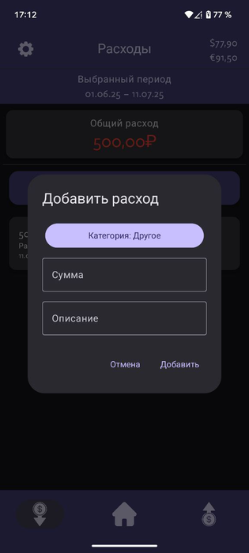

# 💸 MMM

Современное Android-приложение для учёта личных финансов: доходы, расходы, категории, аналитика и поддержка нескольких валют.

---

## 📱 Описание

**MMM** — это удобное приложение для отслеживания финансов, позволяющее быстро добавлять операции, анализировать траты и доходы, а также управлять категориями. Поддерживается работа с несколькими валютами и гибкая фильтрация по периодам.

---

## 🖼️ Скриншоты

| Главный экран | Добавление операции | Аналитика | Настройки |
|---------------|---------------------|-----------|-----------|
|  |  |  | |

---

## 🧩 Структура приложения

- **Главный экран:** Сводка по балансу, быстрый доступ к операциям
- **Доходы/Расходы:** Просмотр и добавление операций по категориям
- **Категории:** Управление и локализация категорий
- **Аналитика:** Графики и фильтры по периодам
- **Настройки:** Выбор валюты, темы, локализация

---

## 🛠️ Технологии

- **Kotlin, Jetpack Compose** — UI и навигация
- **Room** — локальная база данных
- **Retrofit** — получение курсов валют
- **MVVM** — архитектура приложения
- **Material Design** — современный внешний вид

---

## 🚀 Быстрый старт
**1**
1. Клонируйте репозиторий:
   ```bash
   git clone https://github.com/iam965/FinanceProject
   ```
2. Откройте проект в Android Studio.
3. Соберите и запустите на эмуляторе или устройстве.

**2**
   второсой способ

---

## 📦 Примеры кода

### Модель операции

```kotlin
@Entity(
    tableName = "operations",
    foreignKeys = [
        ForeignKey(
            entity = Category::class,
            parentColumns = ["id"],
            childColumns = ["categoryId"],
            onDelete = ForeignKey.CASCADE
        )
    ]
)
data class Operation(
    @PrimaryKey(autoGenerate = true) val id: Long,
    val description: String,
    val value: Double,
    val isprofit: Boolean,
    val date: String,
    val categoryId: Int
)
```

### ViewModel

```kotlin
class FinanceViewModel(application: Application, private val UiState: UIState) : AndroidViewModel(application) {
    val allOperations: StateFlow<List<Operation>>
    val isDarkTheme: State<Boolean>
    val currency: MutableState<CurrencyState>

    fun insertOperation(operation: Operation) { /* ... */ }
    fun deleteOperation(operation: Operation) { /* ... */ }
    fun changeTheme() { /* ... */ }
    fun getDailyRates(forced: Boolean = false) { /* ... */ }
    // ...
}
```

### Пример навигации

```kotlin
class FinanceNavigationBar {
    @Composable
    fun BottomNavBar(navController: NavController) {
        NavigationBar {
            items.forEach { navItem ->
                NavigationBarItem(
                    selected = currentRoute == navItem.route,
                    onClick = { navController.navigate(navItem.route) { /* ... */ } },
                    icon = { Icon(painter = BitmapPainter(ImageBitmap.imageResource(navItem.image)), contentDescription = navItem.title) }
                )
            }
        }
    }
}
```
---
## 🗂️ Структура проекта

```plaintext
app/
  └── src/
      ├── main/
      │   ├── java/com/financeproject/
      │   │   ├── data/
      │   │   │   ├── api/
      │   │   │   ├── db/
      │   │   ├── ui/
      │   │   │   ├── navigation/
      │   │   │   ├── screens/
      │   │   │   ├── state/
      │   │   │   ├── theme/
      │   │   │   ├── viewmodels/
      │   │   ├── utils/
      │   │   └── MainActivity.kt
      │   ├── res/
      │   │   ├── drawable/
      │   │   ├── values/
      │   │   └── ...
      │   └── AndroidManifest.xml
      ├── test/
      └── androidTest/
build.gradle.kts
settings.gradle.kts
README.md
screenshots/
```
---

## 🎨 UI/UX

- Современный дизайн, поддержка светлой и тёмной темы
- Адаптивные элементы управления
- Локализация (многоязычность)

---

## 👨‍💻 Автор

**Ваше Имя**  
- 📧 Email: [your.email@example.com](mailto:your.email@example.com)
- 🐱 GitHub: [@yourusername](https://github.com/yourusername)
- 📱 Telegram: [@yourusername](https://t.me/yourusername)

---

## 📄 Лицензия

MIT License © 2024 [Ваше Имя]

---

Сделано с ❤️ для учёта ваших финансов!
