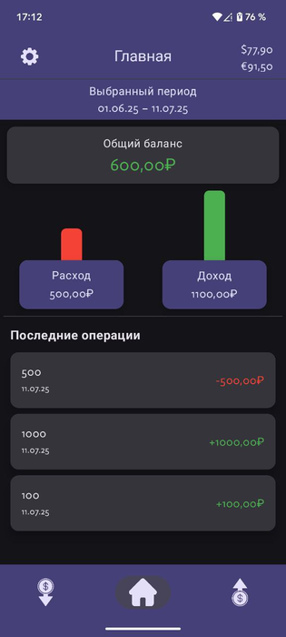
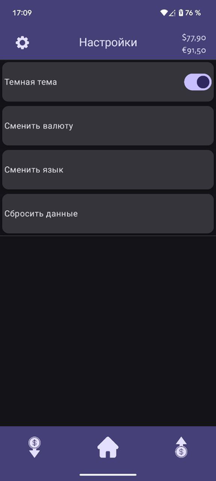

# 💸 MMM

Современное Android-приложение для учёта личных финансов: доходы, расходы, категории, аналитика и поддержка нескольких валют.

---

## 📱 Описание

**MMM** — это удобное приложение для отслеживания финансов, позволяющее быстро добавлять операции, анализировать траты и доходы, а также управлять категориями. Поддерживается работа с несколькими валютами и гибкая фильтрация по периодам.

---

## 🖼️ Скриншоты

| Главный экран | Добавление операции | Аналитика | Настройки |
|--------------|---------------------|-----------|-----------|
|  | |  |  |

---

## 🧩 Структура приложения

- **Главный экран:** Сводка по балансу, быстрый доступ к операциям
- **Доходы/Расходы:** Просмотр и добавление операций по категориям
- **Категории:** Управление и локализация категорий
- **Аналитика:** Графики и фильтры по периодам
- **Настройки:** Выбор валюты, темы, локализация

---

## 🛠️ Технологии

- **Kotlin, Jetpack Compose** — UI и навигация
- **Room** — локальная база данных
- **Retrofit** — получение курсов валют
- **MVVM** — архитектура приложения
- **Material Design** — современный внешний вид

---

## 🚀 Быстрый старт

1. Клонируйте репозиторий:
   ```bash
   git clone https://github.com/iam965/FinanceProject
   ```
2. Откройте проект в Android Studio.
3. Соберите и запустите на эмуляторе или устройстве.

---

## 📦 Примеры кода

### Модель операции

```kotlin
@Entity(tableName = "operations")
data class Operation(
    @PrimaryKey(autoGenerate = true) val id: Int = 0,
    val amount: Double,
    val category: String,
    val date: Long,
    val type: String // "income" или "expense"
)
```

### ViewModel

```kotlin
class FinanceViewModel @Inject constructor(
    private val operationRepository: OperationRepository,
    private val categoryRepository: CategoryRepository
) : ViewModel() {
    val operations = MutableStateFlow<List<Operation>>(emptyList())
    // ...
    fun addOperation(operation: Operation) { /* ... */ }
    fun getBalance(): Double { /* ... */ }
}
```

### Пример навигации

```kotlin
@Composable
fun FinanceNavigationBar(navController: NavController) {
    // ...
    BottomNavigation {
        // ...
    }
}
```

---

## 🗂️ Структура проекта


---

## 🎨 UI/UX

- Современный дизайн, поддержка светлой и тёмной темы
- Адаптивные элементы управления
- Локализация (многоязычность)

---

## 👨‍💻 Автор

**Ваше Имя**  
- 📧 Email: [your.email@example.com](mailto:your.email@example.com)
- 🐱 GitHub: [@yourusername](https://github.com/yourusername)
- 📱 Telegram: [@yourusername](https://t.me/yourusername)

---

## 📄 Лицензия

MIT License © 2024 [Ваше Имя]

---

Сделано с ❤️ для учёта ваших финансов!
